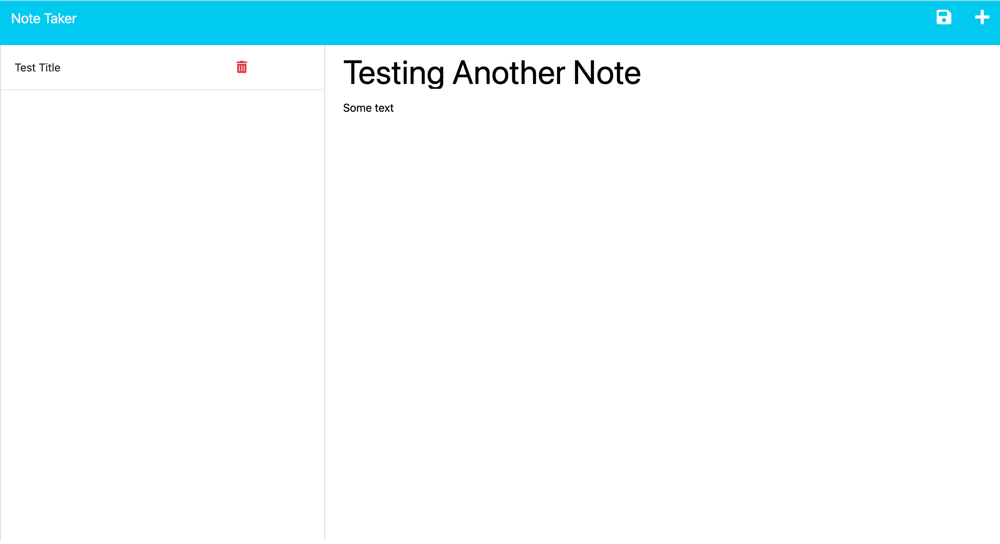
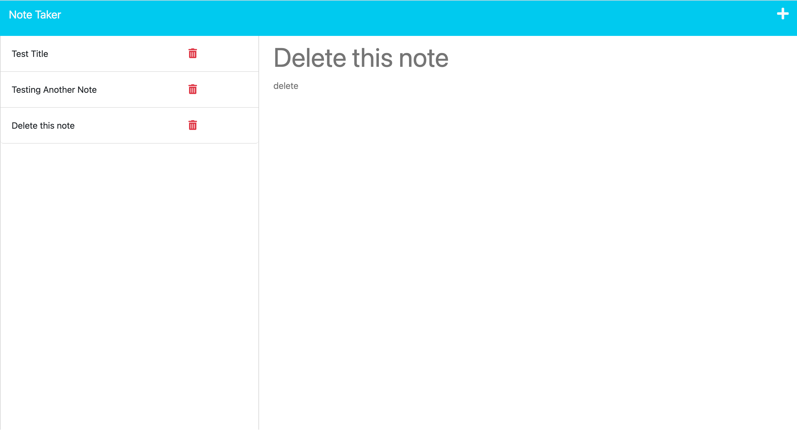
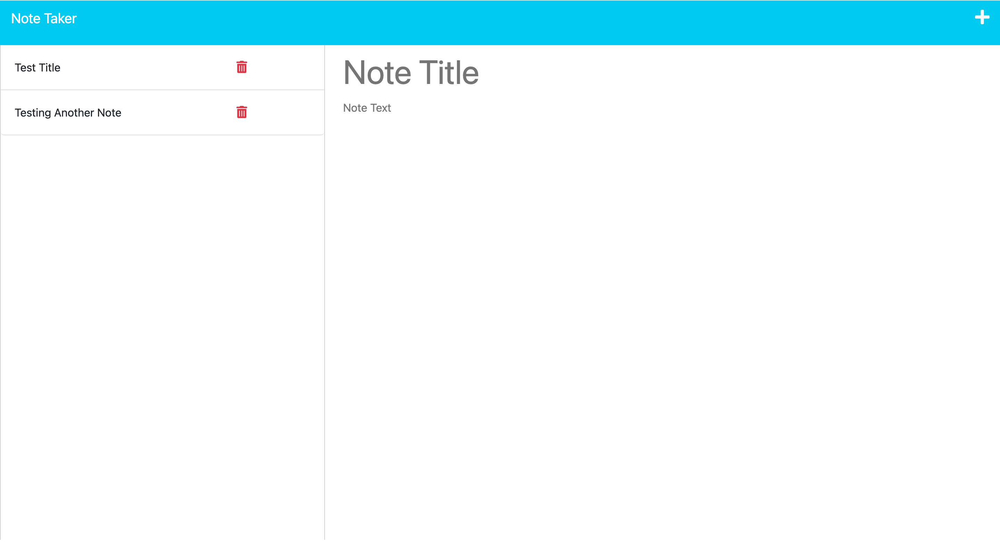

# Express.js-Challenge-Note-Taker

Link to deployed application: https://git.heroku.com/note-taker-app-challenge11.git 

# Description 

This is a full stack web application that allows users to write, save, and delete notes. With this Note Taker app, you can create a note with a title and text content, view previously saved notes, and delete notes that are no longer needed. The application saves and retrieves note data from a JSON file.

# Installation

Before using the Note Taker, make sure you have Node.js installed in your environment.

# Usage

To use this application, follow these steps:

1. Clone this repository.
2. Navigate to the repository folder on your local machine via the terminal.
3. Install the required dependencies using npm install.
4. Run the application using node server.js.
5. Navigate to http://localhost:3001 in your web browser to use the application.
6. To create a note, click on the "+" icon on the top right. To save the note, click the floppy disk icon that appears once you start typing. Your saved notes will appear on the left-hand side of the screen. Clicking a saved note will display its content. 
7. To delete a note, click on the red trash can icon next to the note's title.

## Credits

Starter Code was provided by Columbia. 
Back end code was written with the assitance of activities found in Week 11. 